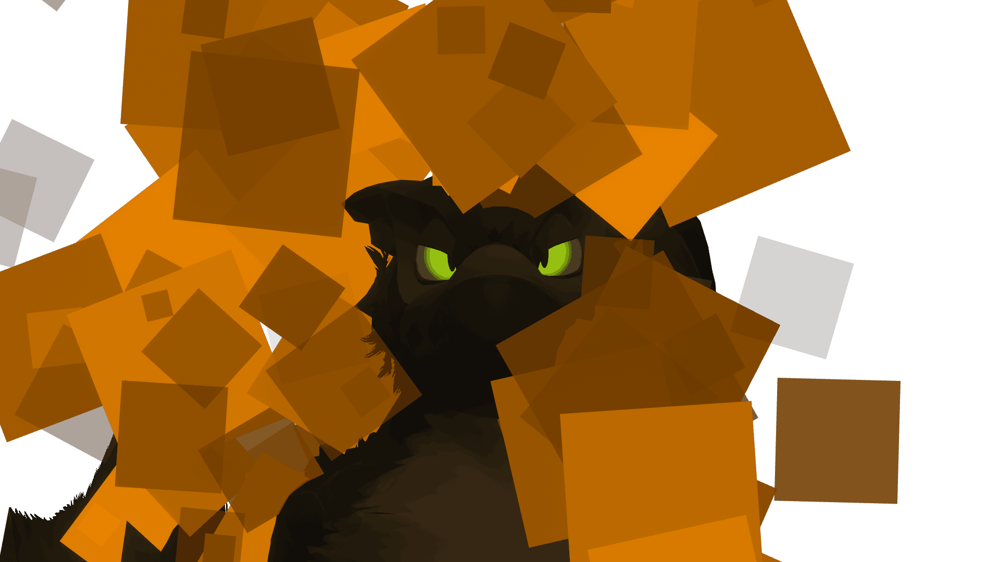
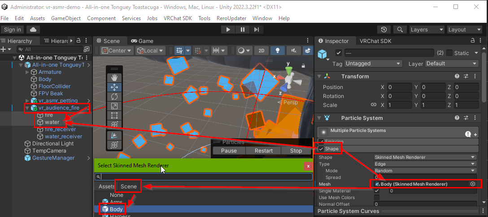
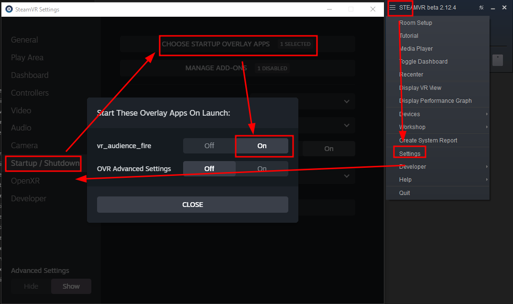

**WORK IN PROGRESS UNTIL END OF 2025, MAY NOT WORK**

# VR Audience Fire/Water

Makes you combustible in VRChat. Also get extinguished by water sprays.

### Marketplace + Demonstration video 🛒

 - https://python1320.gumroad.com/l/vr_audience_fire

### Includes 📦📦📦
 
 - Installation instructions 👉
 - VRCFury Unity Avatar drag-and-drop prefab to become combustible 📦
 - Open source utility application (needed for automatic fire triggering!) 🛠️

### What it doesn't do 🛑

 - Allow you to send fire
 - Respawn afterwards

### How does it work
When someone uses a flame thrower, they have a [contact sender](https://creators.vrchat.com/avatars/avatar-dynamics/contacts/) with tag "fire". Your avatar then has a contact receiver (from this addon's prefab) with the same tag "fire" which sets an avatar parameter "fire" temporarily. This is relayed via [OSC](https://docs.vrchat.com/docs/osc-overview) to helper application, which sends another OSC message back to VRChat to turn on [boolean avatar parameter](https://creators.vrchat.com/avatars/animator-parameters/) named `fire_effect`, which stays on, and is networked to other players so they can see fire. This networked status can then be used to turn on a fire gameobject (from the prefab), which has a fire particle effect.
Extinguish works the same, but turns off fire effect, etc.
Additional ideas can be programmed to the helper application, like eventual random extinguishing, or PiShock support.

### Requirements 📓

 - SteamVR
 - Windows (might work on linux)
 - VRChat (ChilloutVR should also work, but is not documented and probably no longer needed. Resonite also does not need this addon.)
 - Some knowledge about [OSC](https://docs.vrchat.com/docs/osc-overview)
 - Your custom avatar source code. Used in examples: [TongueyToastacuga by 'a distraction'](https://drive.google.com/drive/folders/1ekIiFBnzJNhH2a6wwYLo2s5G-VuUlIY5)
 - [Unity editor](https://creators.vrchat.com/sdk/current-unity-version/) for avatars 
 - [VRCFury](https://vrcfury.com/getting-started)

### Test Avatar(s) 😎

 - **Receiving fire**:
    - [Free ASMR Demo Avatar: Nargacuga](https://vrchat.com/home/avatar/avtr_48cccc45-f524-4a8a-9521-368252334959) [(source)](https://www.vrcarena.com/assets/ZszLG-toastacuga)
 - **Sending avatars**
    - [Fire breathing asset](https://violentpainter.gumroad.com/l/vfx-firebreathing) has demo avatars in description
 - [Help by recommending public avatars](https://github.com/Python1320/vr_audience_fire/issues/1)

### Parameters 📋

| path                            | type | Dir           |
|---------------------------------|------|---------------|
| /avatar/parameters/fire         | bool | input         |
| /avatar/parameters/fire_effect  | bool | output/effect |
| /avatar/parameters/water        | bool | input         |
| /avatar/parameters/water_effect | bool | output/effect |

**Networked/Synced**: 2 bits

Contact names are in prefab.

### Compatible addons 

These addons can extinguish you or make you catch on fire (be warned!)

 - [Spray Bottle for VRC](https://jinxxy.com/market/listings/3292261612823512778) (free)
 - [Fire-Breathing & Flame Sneeze](https://violentpainter.gumroad.com/l/vfx-firebreathing)
 - [Allow others to use voice command to make you catch on fire](https://github.com/Python1320/vr_audience_control)

TODO: Better fire particle addon

### VRChat Group(s)

 - [Combustible](https://vrchat.com/home/group/grp_2e0126aa-fe02-402b-88c9-6d96f14fdf21)

### Installation Video Help 📹

 - [Using VRCFury prefab assets in Unity](https://www.youtube.com/watch?v=QDvzfLa82yI)

### Installation Instructions ℹ️

TODO 

The steps are mostly the same as here https://morghus.gumroad.com/l/cugahoodie (replace with vr_audience_fire.unitypackage)

**Unity**

 1. Install Creator Companion and [VRCFury](https://vrcfury.com/getting-started)
 2. Download the unitypackage and import it
 3. TAKE A BACKUP OF YOUR AVATAR HERE
 4. Import the downloaded `.unitypackage`: 
   - double click the package
   - ... or in Unity: Menu Assets -> Import Package -> Custom Package
 5. Drag the imported prefab into the scene
   - Locate the TODO directory in the Project tab, within you'll find a "TODO" object. 
      - Click and drag it onto the main Avatar object in your Hierarchy. It should be a direct child of the object.
	  - Once the prefab has been put in the correct place, it should show up on your avatar in the Scene view.
	  - The package includes a script that will automatically setup sounds to correct hand bones. No manual setup should be necessary.
      - Do not disable the "VRPets Prefab" object itself as the pets will not work properly
 6. Run build and test or republish your avatar
 7. Remember to enable OSC and to regenerate OSC config!

  - VRCFury will automatically add a new [expression menu](https://docs.vrchat.com/docs/action-menu#expression-menu) entry and you will be able to toggle the fire on and off there. Test it in game and see if it works. 

**ADDITIONAL STEP IN UNITY: FIX WATER AND FIRE**

To make the prefab's fire surround your avatar, you need to tell it which mesh should be used for fire emission. 
Do this for both water and fire:

**Helper Application**
 1. Download the latest `vr_audience_fire_helper.zip` from [releases](https://github.com/Python1320/vr_audience_fire/releases)
 2. Extract the ZIP file to somewhere
 4. Run `vr_audience_fire.exe` once. *If unsure you can run it a second time and it will give an error about already running. If this does not happen the program is somehow crashing.*
 5. The program runs in background. Look in task manager for status.
 6. In case of trouble run `vr_audience_fire_console.exe` to see debug output. You may also need to set debug to true in `config.json`
 7. Look in [`config.json`](https://github.com/Python1320/vr_asmr_petting/blob/main/src/config.json) for additional settings.
 8. The program quits when SteamVR quits

### Troubleshooting 🎯

 1. Ensure you have Avatar Self Interact enabled in the VRChat settings menu: 
 2. [Enable OSC](https://docs.vrchat.com/docs/osc-overview#enabling-it)
 3. Use [OSC Debug](https://docs.vrchat.com/docs/osc-debugging) to see if are receiving any data
 4. Make sure your VRChat SDK is updated in the companion app! VRCFury usually requires the latest VRChat SDK.

The application generates a `debug.log` file on start. This can provide clues on what is wrong.

### Known Issues 📌

https://github.com/python1320/vr_audience_fire/issues

### How to change the sounds 

 - Navigate to the prefab and into the fire and just replace the sound file with your own

### Helper app automatic start ℹ️

After launching the helper exe successfully once, you should be able to enable autostart in SteamVR:

### NO SUPPORT NO WARRANTY

This is a hobby for me, paying only gives you access to the asset files. Payment does not give support. I may or may not have time to look at github issues but that's about it.
No warranty of any kind!
I cannot afford supporting you, and you cannot afford my support, sorry. Feel free to ask someone else to fix things for you.
