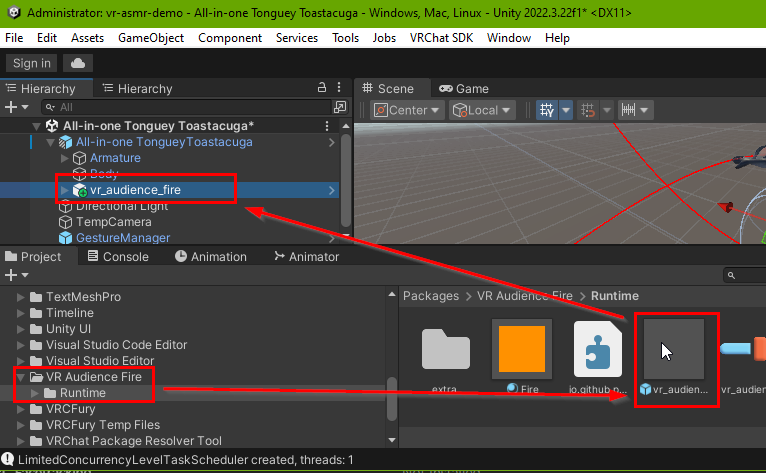

**WORK IN PROGRESS UNTIL END OF 2025, MAY NOT WORK**

# Audience Triggered Fire 🔥 and Water 💦 Effects in VRChat

Makes you combustible in VRChat. Also get extinguished by water sprays.

### Marketplace + Demonstration video 🛒

 - https://python1320.gumroad.com/l/vr_audience_fire

### Includes 📦📦📦
 
 - Installation instructions 👉
 - VRCFury Unity Avatar drag-and-drop prefab to become combustible 📦
 - Open source utility application (needed for automatic fire triggering!) 🛠️

**🛑 NOT YET COMPATIBLE WITH QUEST 🛑**

### What it does not do 🛑

 - Allow you to send fire
 - Respawn afterwards
 - Fires in worlds cannot make you catch on fire. Worlds cannot have contact senders :(

### Requirements 📓

 - SteamVR
 - Windows (might work on linux)
 - VRChat (ChilloutVR should also work, but is not documented and probably no longer needed. Resonite also does not need this addon.)
 - Some knowledge about [OSC](https://docs.vrchat.com/docs/osc-overview)
 - Your custom avatar source code. Used in examples: [TongueyToastacuga by 'a distraction'](https://drive.google.com/drive/folders/1ekIiFBnzJNhH2a6wwYLo2s5G-VuUlIY5)
 - [Unity editor](https://creators.vrchat.com/sdk/current-unity-version/) for avatars 
 - [VRCFury](https://vrcfury.com/getting-started)

### Compatible addons 🧩

These addons can extinguish you or make you catch on fire (be warned!)

 - [Spray Bottle for VRC](https://jinxxy.com/market/listings/3292261612823512778) (free)
 - [Fire-Breathing & Flame Sneeze](https://violentpainter.gumroad.com/l/vfx-firebreathing)
 - [Allow others to use voice command to make you catch on fire](https://github.com/Python1320/vr_audience_control)

**TODO**: Better fire particle addon

### Installation 🔨

**NOTE**: *Help improve the introductions by [updating this readme](https://github.com/Python1320/vr_audience_fire/edit/main/README.md)*

(*Video help: [Using VRCFury prefab assets in Unity](https://www.youtube.com/watch?v=QDvzfLa82yI)*)

**Unity** 🧊

 1. Install [Creator Companion](https://vcc.docs.vrchat.com/) and add [VRCFury](https://vrcfury.com/getting-started).   
     You also need your avatar as a project!   

 2. In creator companion
    1. Add `vr_audience_fire` by pressing "add to VCC" in [this](https://python1320.github.io/vr_audience_fire/) page.
    2. Install the "VR Audience Fire" package to your avatar. (*Remember to install VRCfury if not already installed!*)
    3. Open the avatar in unity

 3. **Recommended**: *backup avatar now!*

 4. Find the "vr audience fire" package and the prefab inside it.   
    Drag and drop it into the avatar (note: the prefab must be put under avatar in the hierarchy but NOT inside armature/body, see picture):
 
 
 5. To make the prefab's fire surround your avatar, you need to tell it which mesh should be used for fire emission.   
Do this for both water and fire:

 6. **Optional**: the prefab comes with an example sound effect, you may want to remove it (go under the prefab in hierarchy and remove the audio component from the fire game object)

 7. **Optional**: *test with [gesture manager](https://github.com/BlackStartx/VRC-Gesture-Manager?tab=readme-ov-file#how-to-use-sdk-30)*
 
 8. Publish your avatar

 9. Remember to [enable OSC](https://docs.vrchat.com/docs/osc-overview#enabling-it) and to regenerate OSC config in VR (otherwise helper app will not work)!

  - VRCFury will automatically add a new [expression menu](https://docs.vrchat.com/docs/action-menu#expression-menu) entry and you will be able to toggle the fire on and off there. Test it VRChat and see if it works. 

**Helper Application** 🛠️ *(required)*
 
 1. Download the latest `vr_audience_fire_helper.zip` from [releases](https://github.com/Python1320/vr_audience_fire/releases)

 2. There is no installer! Just extract the ZIP file somewhere where you don't remove/rename it accidentally.

 3. **IMPORTANT (Windows SmartScreen / Antivirus):**
   Windows SmartScreen or your antivirus might show a warning about an unknown executable. This happens, because the helper application does not have a digital signature as it would cost too much.
   If downloaded from the official GitHub release, the helper application should be safe.
   **SmartScreen Dialog:** Click "More info" then "Run anyway". For antivirus, choose to "Allow" or "Trust" the application.

 4. Start SteamVR and run `vr_audience_fire.exe` once in the extracted zip folder.   
    *If unsure you can run it a second time and it will give an error about already running. If this does not happen the program is somehow crashing.*

 5. **Note**: The program runs in background. Look in task manager for status.
 
 6. **Troubleshooting:** In case of trouble, run `vr_audience_fire_console.exe` to see debug output. You may also need to set debug to true in `config.json`
 
 7. **Advanced**: Look in [`config.json`](https://github.com/Python1320/vr_audience_fire/blob/main/src/config.json) for additional settings.
 
 8. **Note:** The program quits when SteamVR quits
 
 9. **Optional**: Enable helper autostart in SteamVR settings 

 10. Find someone to breathe fire on you or to use the spray bottle prefab on you to drip water

### Troubleshooting 🎯

 1. Ensure you have Avatar Self Interact enabled in the VRChat settings menu: 
 2. [Enable OSC](https://docs.vrchat.com/docs/osc-overview#enabling-it)
 3. Use [OSC Debug](https://docs.vrchat.com/docs/osc-debugging) to see if are receiving any data
 4. Make sure your VRChat SDK is updated in the companion app! VRCFury usually requires the latest VRChat SDK.
 5. Check that antivirus 🛡️ and firewall 🔒👮 are not blocking the helper application!

**HINT:** *The application generates a `debug.log` file on start if debug is enabled. This can provide clues on what is wrong. You should include this file with bug reports, thank you!*  

### Known Issues 📌

https://github.com/python1320/vr_audience_fire/issues

### How does it work ❓
When someone uses a flame thrower, they have a [contact sender](https://creators.vrchat.com/avatars/avatar-dynamics/contacts/) with tag "fire".
 Your avatar then has a contact receiver (from this addon's prefab) with the same tag "fire" which sets an avatar parameter "fire" temporarily. 

 This is relayed via [OSC](https://docs.vrchat.com/docs/osc-overview) to helper application, which sends another OSC message back to VRChat to turn on [boolean avatar parameter](https://creators.vrchat.com/avatars/animator-parameters/) named `fire_effect`, which stays on, and is networked to other players so they can see fire. 

 This networked status can then be used to turn on a fire gameobject (from the prefab), which has a fire particle effect.
Extinguish works the same, but turns off fire effect, etc.

*Additional ideas can be programmed to the helper application, like eventual random extinguishing, or PiShock support.*

### Test Avatar(s) 🎭

 - **Receiving fire**:
    - [Free ASMR Demo Avatar: Nargacuga](https://vrchat.com/home/avatar/avtr_48cccc45-f524-4a8a-9521-368252334959) ([source](https://www.vrcarena.com/assets/ZszLG-toastacuga))
 - **Sending fire**
    - [Fire breathing asset](https://violentpainter.gumroad.com/l/vfx-firebreathing) has demo avatars in description
 - [Help by recommending public avatars](https://github.com/Python1320/vr_audience_fire/issues/1)

### Parameters 📋

| path                            | type | Dir           |
|---------------------------------|------|---------------|
| /avatar/parameters/fire         | bool | input         |
| /avatar/parameters/fire_effect  | bool | output/effect |
| /avatar/parameters/water        | bool | input         |
| /avatar/parameters/water_effect | bool | output/effect |

**Networked/Synced**: 2 bits

Contact names are in prefab.

### VRChat Group(s) 👨‍👨‍👦‍👦

 - [Combustible](https://vrchat.com/home/group/grp_2e0126aa-fe02-402b-88c9-6d96f14fdf21) - find if someone might be combustible or get help testing

### How to change the sounds 👂

 - Navigate to the prefab and into the fire and just replace the sound file with your own

### Helper app automatic start ℹ️

After launching the helper exe successfully once, you should be able to enable autostart in SteamVR:

### NO SUPPORT NO WARRANTY

This is a hobby for me, paying only gives you access to the asset files. Payment does not give support. I may or may not have time to look at github issues but that's about it.
No warranty of any kind!
I cannot afford supporting you, and you cannot afford my support, sorry. Feel free to ask someone else to fix things for you.
